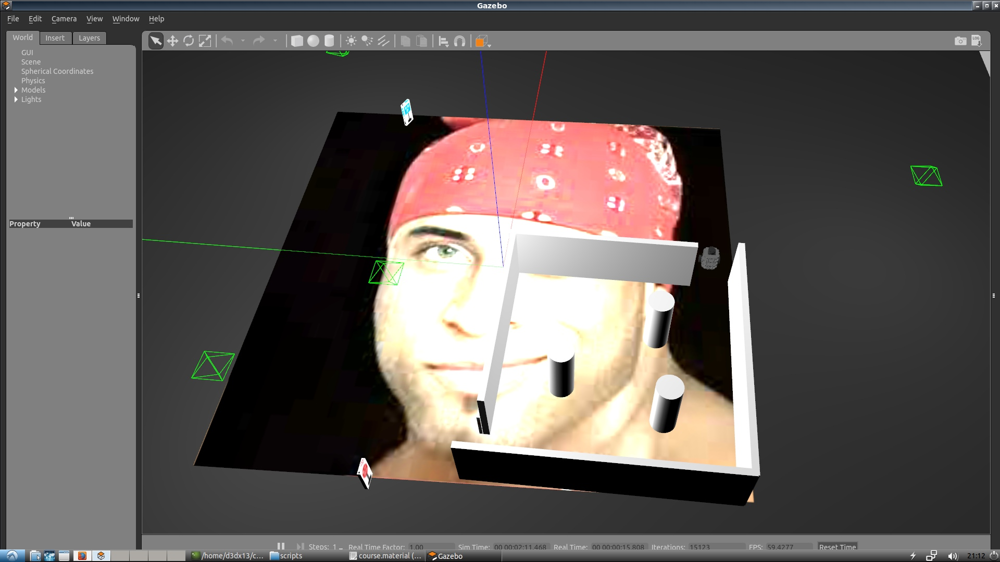

# Настройка рабочего окружения
В данном руководстве описано, как установить ubuntu 16.04, ROS kinetic и как настроить работу с этим git репозиторием.

##### 1. Установка ubuntu 16.04

Сначала качаем образ. Рекомендую ubuntu 16.04.6 с графической оболочкой LXDE [скачать с официального сайта](http://cdimage.ubuntu.com/lubuntu/releases/16.04/release/lubuntu-16.04.6-desktop-amd64.iso)

Потом записываем образ на флешку и устанавливаем, используя [величайший сайт](google.com) и [не менее великий сайт](https://losst.ru/ustanovka-linux-ryadom-s-windows-10)

> Важно выполнить обновление системы после установки, поэтому ОБЯЗАТЕЛЬНО пропишите следующие команды в терминале. 

```bash
sudo apt update -y && sudo apt upgrade -y && sudo apt dist-upgrade -y && sudo apt autoremove -y
```

> P.S. Прописывайте это в терминале после каждого запуска linux, чтобы отсутствие обновлений не обрушило вам иксы [лулзы](http://lurkmore.to/%D0%9F%D0%BB%D0%B0%D0%B7%D0%BC%D0%B0_%D0%BD%D0%B5_%D0%BF%D0%B0%D0%B4%D0%B0%D0%B5%D1%82). Да, отчасти из-за этого я рекомендую LXDE. У вас ничего не упадёт, если нет графических финтифлюшек. 

##### 2. Установка ROS

Для ubuntu 16.04 доступен [ROS kinetic](http://wiki.ros.org/kinetic/Installation/Ubuntu). Для особенно ленивых вот готовая последовательность bash команд для установки полной версии.

```bash
sudo sh -c 'echo "deb http://packages.ros.org/ros/ubuntu $(lsb_release -sc) main" > /etc/apt/sources.list.d/ros-latest.list'

sudo apt-key adv --keyserver 'hkp://keyserver.ubuntu.com:80' --recv-key C1CF6E31E6BADE8868B172B4F42ED6FBAB17C654

sudo apt-get update

sudo apt-get install ros-kinetic-desktop-full -y

sudo rosdep init
rosdep update

echo "source /opt/ros/kinetic/setup.bash" >> ~/.bashrc
echo "source ~/catkin_ws/devel/setup.bash" >> ~/.bashrc
source ~/.bashrc

sudo apt install python-rosinstall python-rosinstall-generator python-wstool build-essential -y

mkdir -p ~/catkin_ws/src
cd ~/catkin_ws/src
catkin_init_workspace
cd ~/catkin_ws
catkin_make
```

##### 3. Клонирование этого репозитория и настройка ROS для него

Подразумевается, что вы читаете это на сайте ~~pornhub~~ github, однако для работы нам потребуется клонировать репозиторий. Для простоты клонирую его в домашнюю папку.

```bash
cd ~
git clone https://github.com/d3dx13/StarLine_Hackathon.git
```

После сего настроем встроенную папку catkin_ws.

```bash
echo "source ~/StarLine_Hackathon/catkin_ws/devel/setup.bash" >> ~/.bashrc
source ~/.bashrc
```

Далее необходимо настроить удалённую работу с роботом. Если вы запускаете всё на вашем компьютере, вставьте localhost вместо обоих адресов.

```bash
echo "export ROS_MASTER_URI=http://{IP адрес turtlebot3}:11311" >> ~/.bashrc
echo "export ROS_HOSTNAME={IP адрес данного компьютера}" >> ~/.bashrc
source ~/.bashrc
```

##### 4. Заключение

На этом установка окончена. Вы можете разрабатывать под ROS на python. Если же хотите использовать C++ [курите](http://wiki.ros.org/ROS/Tutorials)

##### Для сборки нашего проекта использовать:

```bash
cd ~/StarLine_Hackathon/catkin_ws
catkin_make
```

Проверка корректности установки:

```bash
roslaunch starbot_gazebo turtlebot_world.launch
```

Если симуляция заработала, а также никакой ~~дебил~~ разработчик не сделал **git push --force**   


Тогда вы увидите градус фантазии последнего, кто редачил этот мир:



Закрывайте (или не надо) симуляцию путём нажатия ctrl+C в терминале. <u>Это может занять некоторое время.</u>

