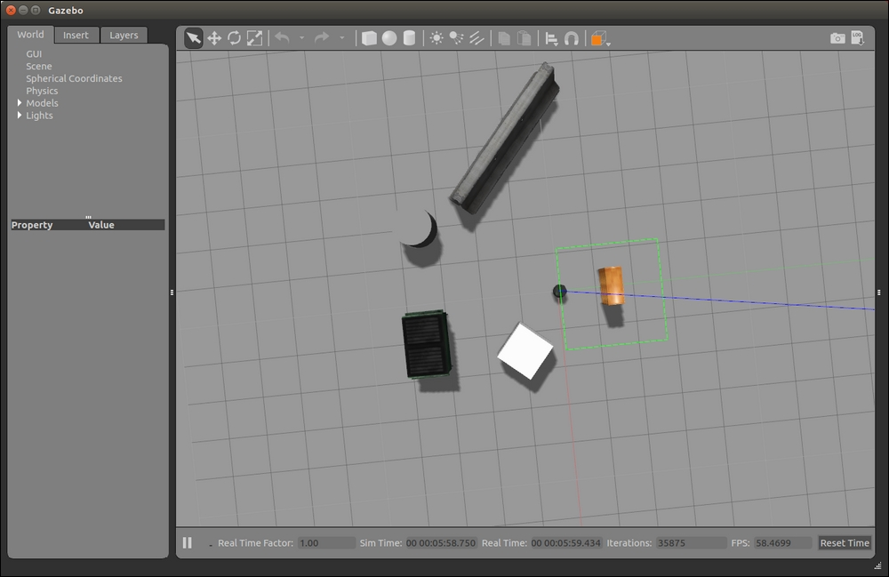

# Настройка окружения turtlebot2
В данном руководстве описано, как настроить рабочее окружение для работы с turtlebot2 в Gazebo симуляции для ROS kinetic. 

##### Установка пакетов turtlebot2 и симуляции

Руководство для работы с [turtlebot2](http://wiki.ros.org/turtlebot/Tutorials/indigo) от [wiki.ros.org](http://wiki.ros.org)

Сначала *модифицируем ядро*. На этом этапе могут появиться предупреждения, мы же просто пропускам всё, следуя лучшим советам на [askubuntu](https://askubuntu.com/questions/1162356/failed-to-fix-broken-packages-in-ubuntu-16-04):

```bash
sudo apt-get install -y linux-headers-generic

sudo sh -c 'echo "deb-src http://us.archive.ubuntu.com/ubuntu/ xenial main restricted deb-src http://us.archive.ubuntu.com/ubuntu/ xenial-updates main restricted deb-src http://us.archive.ubuntu.com/ubuntu/xenial-backports main restricted universe multiverse deb-src http://security.ubuntu.com/ubuntu xenial-security main restricted" > \/etc/apt/sources.list.d/official-source-repositories.list'
```

Ставим необходимые пакеты:

```
sudo apt-get update

sudo apt-get install ros-kinetic-librealsense

sudo apt-get install ros-kinetic-turtlebot

sudo apt-get install ros-kinetic-turtlebot-apps

sudo apt-get install ros-kinetic-turtlebot-interactions

sudo apt-get install ros-kinetic-turtlebot-simulator

sudo apt-get install ros-kinetic-ar-track-alvar-msgs
```

Проверка корректности установки:

```bash
roslaunch turtlebot_gazebo turtlebot_world.launch
```

Если на этом этапе вы увидели нечто подобное:



Тогда вы всё сделали правильно.

Закрывайте симуляцию путём нажатия ctrl+C в терминале. <u>Это может занять некоторое время.</u>
